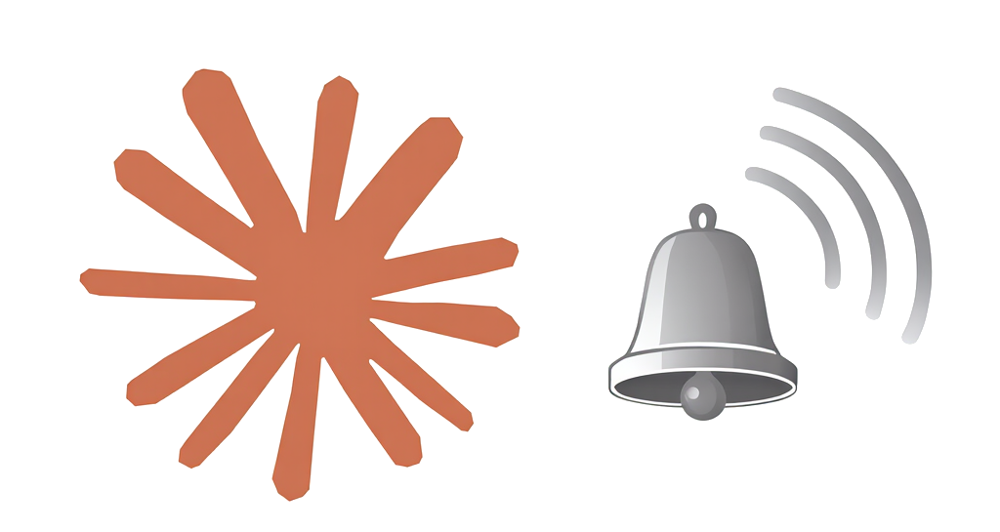

<p align="center">
  
</p>

<h1 align="center">claude-code-notification</h1>

<p align="center">
  Never miss when Claude needs your attention.<br/>
  A Claude Code plugin that sends push notifications when Claude finishes a task, encounters an error, or needs your input.
</p>

---

- [Why?](#why)
- [Installation](#installation)
- [Quick Start](#quick-start)
- [Watched Hook Events](#watched-hook-events)
- [Configuration](#configuration)
  - [Config files](#config-files)
  - [Schema autocompletion](#schema-autocompletion)
  - [Configuration skill](#configuration-skill)
  - [Full config example](#full-config-example)
  - [Merge behavior](#merge-behavior)
- [Backends](#backends)
  - [System Notification](#system-notification)
  - [ntfy](#ntfy)
  - [Sound](#sound)
  - [Custom Script](#custom-script)
- [Logs](#logs)
- [Security](#security)
- [Contributing](#contributing)
- [License](#license)


## Why?

Long-running Claude tasks make it tempting to switch to another window or even another device. This
plugin hooks into Claude Code's lifecycle events and notifies you through one or more backends — so
you can context-switch freely and come back exactly when needed.

Supported backends include:
- **ntfy**: Push notifications to your phone or desktop via [ntfy.sh](https://ntfy.sh) or a self-hosted ntfy server
  > Especially useful for remote claude code sessions
- **Desktop notifications**: Native OS notifications
- **Sound**: Play an audio file
- **Custom scripts**: Run your own scripts when claude needs attention

## Installation

Inside Claude Code, run inside Claude Code:

```
/plugin marketplace add berk-karaal/claude-code-notification
/plugin install claude-code-notification@claude-code-notification
```

> You need to restart Claude Code after first installation.

> This project is currently developed for Linux and macOS. Windows support PRs are welcome!

## Quick Start

After installation, open a new Claude Code session and use `/claude-code-notification:configure`
skill to configure notifications you want to receive. By default, system notifications are enabled
and everything else is disabled.

Example configuration skill usages:

```
/claude-code-notification:configure enable ntfy globally

/claude-code-notification:configure enable sound

/claude-code-notification:configure disable system notifications

/claude-code-notification:configure find me available sound files and let me choose one for each event

/claude-code-notification:configure disable all notifications for this project
```


## Watched Hook Events

This plugin listens to these Claude Code hook events:

| Event            | When it fires                                  | Notification title |
| ---------------- | ---------------------------------------------- | ------------------ |
| **Stop**         | Claude finishes a task                         | Claude Finished    |
| **Notification** | Claude needs input (permission or idle prompt) | Claude Needs Input |
| **StopFailure**  | Claude encounters an error                     | Claude Error       |

## Configuration

### Config files

| Scope           | Path                                                 |
| --------------- | ---------------------------------------------------- |
| **Global**      | `~/.config/claude-code-notification/config.json`     |
| **Per-project** | `.claude-code-notification.json` in the project root |

Per-project config **merges** with global at the field level — only set the fields you want to
override.

### Schema autocompletion

Add `$schema` to the top of your config file to get autocompletion and validation in your editor:

```json
{
  "$schema": "https://raw.githubusercontent.com/berk-karaal/claude-code-notification/main/plugin/schema/config.schema.json"
}
```

### Configuration skill

Inside Claude Code, use the built-in configuration skill:

Run skill without arguments to get an interactive configuration assistant:

```
/claude-code-notification:configure
```

You can also pass hints directly:

```
/claude-code-notification:configure enable ntfy per-project
/claude-code-notification:configure disable sound global
```

Claude will read the schema, ask clarifying questions if needed, and write a valid config file for you.

### Full config example

`~/.config/claude-code-notification/config.json`
```json
{
  "$schema": "https://raw.githubusercontent.com/berk-karaal/claude-code-notification/main/plugin/schema/config.schema.json",
  "system_notification": {
    "enabled": true
  },
  "ntfy": {
    "enabled": true,
    "topic": "my-claude-notifications",
    "server": "https://ntfy.sh"
  },
  "sound": {
    "enabled": true,
    "on_stop": "/System/Library/Sounds/Glass.aiff",
    "on_notification": "/System/Library/Sounds/Ping.aiff",
    "on_stop_failure": "/System/Library/Sounds/Basso.aiff"
  },
  "custom_script": {
    "enabled": true,
    "on_stop": "/path/to/stop.sh",
    "on_notification": "/path/to/notify.sh",
    "on_stop_failure": "/path/to/failure.sh"
  }
}
```

### Merge behavior

Config loads in three layers, each overriding the previous:

1. **Defaults** — `system_notification` enabled, everything else disabled
2. **Global config** — `~/.config/claude-code-notification/config.json`
3. **Per-project config** — `.claude-code-notification.json` in the project root

Omitting a field means "inherit from the layer below". Setting `"enabled": false` explicitly
disables a backend that may be enabled in a lower layer.

---

## Backends

### System Notification

Native OS desktop notifications. **Enabled by default.**

- **macOS**: `osascript` (built-in)
- **Linux**: `notify-send` (part of `libnotify`)

```json
{
  "system_notification": {
    "enabled": true
  }
}
```

### ntfy

Push notifications via [ntfy.sh](https://ntfy.sh) or a self-hosted ntfy server. Get notified on your
phone, desktop, or any device.

| Field    | Required | Default           | Description     |
| -------- | -------- | ----------------- | --------------- |
| `topic`  | Yes      | —                 | ntfy topic name |
| `server` | No       | `https://ntfy.sh` | ntfy server URL |

```json
{
  "ntfy": {
    "enabled": true,
    "topic": "my-claude-notifications",
    "server": "https://ntfy.sh"
  }
}
```

### Sound

Plays an audio file when events fire. Uses `afplay` on macOS or `paplay`/`aplay` on Linux.

If no sound file is specified for an event, the OS default alert sound is used. `on_stop_failure`
falls back to `on_stop` if not set.

| Field             | Required | Description                                     |
| ----------------- | -------- | ----------------------------------------------- |
| `on_stop`         | No       | Audio file for task completion                  |
| `on_notification` | No       | Audio file for input prompts                    |
| `on_stop_failure` | No       | Audio file for errors (falls back to `on_stop`) |

```json
{
  "sound": {
    "enabled": true,
    "on_stop": "/System/Library/Sounds/Glass.aiff",
    "on_notification": "/System/Library/Sounds/Ping.aiff",
    "on_stop_failure": "/System/Library/Sounds/Basso.aiff"
  }
}
```

<details>
<summary>Built-in macOS sounds you can use</summary>

```console
$ ls /System/Library/Sounds
```

</details>

### Custom Script

Run your own scripts when events fire. Context is passed via environment variables — never as
arguments (safe from shell injection).

| Field             | Required | Description                                 |
| ----------------- | -------- | ------------------------------------------- |
| `on_stop`         | No       | Script for task completion                  |
| `on_notification` | No       | Script for input prompts                    |
| `on_stop_failure` | No       | Script for errors (falls back to `on_stop`) |

```json
{
  "custom_script": {
    "enabled": true,
    "on_stop": "/path/to/stop.sh",
    "on_notification": "/path/to/notify.sh"
  }
}
```

Scripts must be executable (`chmod +x`) and receive these environment variables:

| Variable       | Example      | Description                                        |
| -------------- | ------------ | -------------------------------------------------- |
| `CCN_EVENT`    | `Stop`       | Event type (`Stop`, `Notification`, `StopFailure`) |
| `CCN_HOSTNAME` | `my-machine` | Machine hostname                                   |
| `CCN_PROJECT`  | `my-project` | Project directory name                             |

<details>
<summary>Example script</summary>

```bash
#!/usr/bin/env bash

# Send a Slack webhook notification
curl -s -X POST "https://hooks.slack.com/services/YOUR/WEBHOOK/URL" \
  -H 'Content-type: application/json' \
  -d "{\"text\": \"${CCN_EVENT}: ${CCN_PROJECT} on ${CCN_HOSTNAME}\"}"
```

</details>

---

## Logs

Hook scripts log to the plugin data directory:

```bash
tail -f ~/.claude/plugins/data/claude-code-notification/logs/notification.log
```

You can use this for debugging purposes.

## Security

Notifications contain only the event type, machine hostname, and project directory name. **No
prompts, tool I/O, file paths, session IDs, or environment variables are included in notification
content.**

## Contributing

See [CONTRIBUTING.md](CONTRIBUTING.md).

## License

[MIT](LICENSE)
